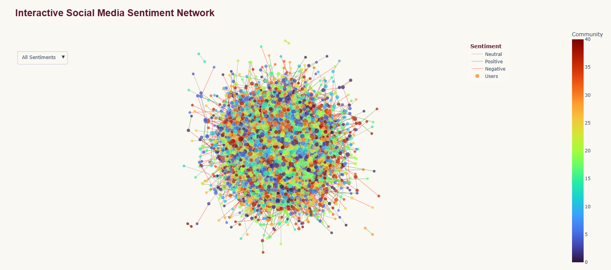
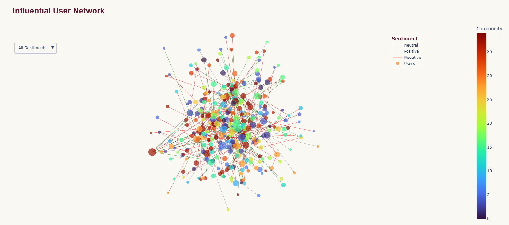

# Social Media Sentiment Network Analysis

An end-to-end social network analysis project exploring **sentiment, information flow, influential users, and community structure** in a synthetic social media network.

This project was developed as part of the **SkilledScore Data Visualization Internship**, supervised by **Dr. Zeeshan Usmani**.

---

## Project Overview

The project analyzes a synthetic social media dataset containing **5,000 users and 20,000 interactions**, including posts, retweets, and replies.

The analysis combines **sentiment analysis, graph analytics, community detection, and interactive visualization** to examine how sentiment and information flow through a social network.

### Key Objectives

- Analyze positive, negative, and neutral sentiment across interactions
- Construct a directed user interaction network
- Identify influential users using degree centrality
- Detect network communities using the Louvain algorithm
- Investigate hashtag-driven echo-chamber behavior
- Visualize sentiment and network structure interactively
- Discuss practical implications for content moderation

---

## Tech Stack

- Python
- Pandas
- NumPy
- NetworkX
- VADER Sentiment Analysis
- Python-Louvain
- Plotly
- Jupyter Notebook

---

## Dataset

A fully **synthetic dataset** was generated for this project.

- **Users:** 5,000
- **Interactions:** 20,000
- **Interaction Types:** Posts, Retweets, Replies
- **Time Period:** January–June 2026
- **Sentiment Range:** -1 to +1

### Main Features

- User ID
- Target User ID
- Post ID
- Timestamp
- Interaction Type
- Hashtag
- Post Text
- Sentiment Score

The synthetic design allows the complete analytical workflow to be demonstrated without using private or real-world social media data.

---

## Methodology

### 1. Data Generation & Cleaning

Synthetic users, posts, timestamps, hashtags, interaction types, and post text were generated programmatically.

Duplicate interactions were removed and low-activity source users were filtered before network analysis.

### 2. Sentiment Analysis

**VADER (Valence Aware Dictionary and sEntiment Reasoner)** was used to calculate compound sentiment scores.

Interactions were classified as:

- **Positive:** score ≥ 0.05
- **Negative:** score ≤ -0.05
- **Neutral:** between -0.05 and 0.05

### 3. Network Construction

A directed network was created using **NetworkX**.

- **Nodes:** Social media users
- **Edges:** Retweet and reply interactions
- **Node size:** Degree centrality
- **Edge sentiment:** Positive, negative, or neutral

Original posts remain part of the dataset but are not represented as user-to-user edges because they have no target user.

### 4. Community Detection

The **Louvain algorithm** was applied to identify communities within the network.

A force-directed layout was used to visualize network structure while preserving relationships between connected users.

### 5. Influencer Analysis

Degree centrality was used to identify highly connected users.

A focused influencer network was created using the **top 30 influential users and their direct network neighbors**.

---

## Interactive Social Media Sentiment Network

The complete network visualization shows user communities and sentiment-driven interactions.



The interactive Plotly implementation also supports node hover information and sentiment-based filtering.

---

## Influential User Network

A focused network highlights influential users and their immediate connections.



---

## Key Findings

The final reproducible analysis produced:

- **4,873 network users**
- **9,796 retweet/reply interaction records**
- **41 Louvain communities**
- **37.12% neutral sentiment**
- **33.48% negative sentiment**
- **29.40% positive sentiment**
- **13.86% maximum dominant-hashtag concentration among meaningful communities**

Degree centrality revealed users with comparatively high network influence, while the larger detected communities generally contained mixed sentiment and hashtag activity.

The relatively low dominant-hashtag concentration provided **limited evidence of strong hashtag-driven echo chambers** within this synthetic network.

---

## Moderation Insights

The network analysis suggests several useful analytical principles:

- High-influence users can be prioritized when investigating information diffusion.
- Sentiment can serve as a screening signal but should not by itself determine whether content violates a policy.
- Community and hashtag membership provide contextual information rather than sufficient evidence for moderation decisions.
- Network structure can complement content-level analysis when investigating interaction patterns.

---

## Repository Structure

```text
social-media-sentiment-network-analysis/
│
├── data/
│   ├── social_media_interactions_raw.csv
│   └── social_media_interactions_cleaned.csv
│
├── visuals/
│   ├── social_media_sentiment_network.png
│   └── influential_user_network.png
│
├── Social_Media_Sentiment_Network_Analysis.ipynb
├── Social_Media_Sentiment_Network_Analysis_Presentation.pdf
└── README.md
```
---

## Internship

Developed as part of the **SkilledScore Data Visualization Internship**.

**Supervisor:** Dr. Zeeshan Usmani  
**Intern:** Usman Ali

---
